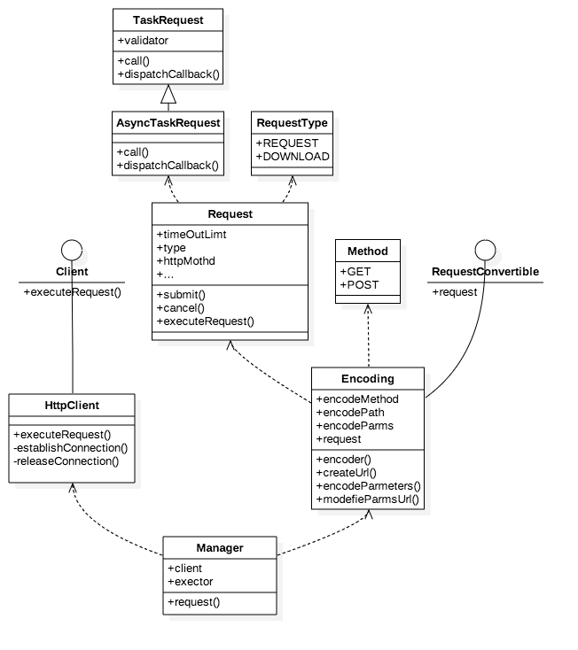
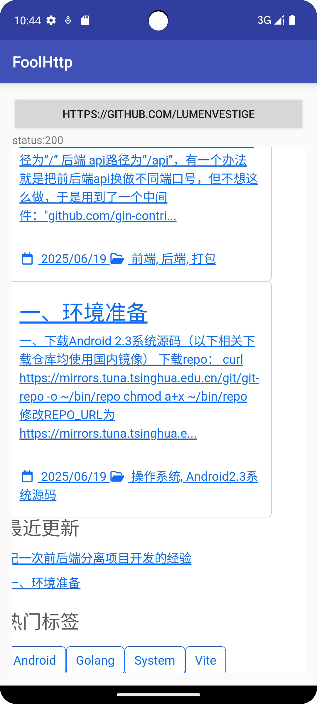

# FoolHttp

### Note:  

An Android lightweight network library built on libcurl, designed for simple HTTP communication.

### Demo of using:  


method: ```fun get(path: String, parameters: List<Pair<String, Any?>>? = null, successCallBack: (response: Response) -> Unit = null!!, failCallBack: (response: Response, request: Request) ->Unit = null!!) ```,you can find get demo from Manager.

Simple demo:  


	 test1.setOnClickListener { view ->

            FoolHttp.get("https://www.baidu.com", null, { response ->
                runOnUiThread {
                    codeText.text = "status:" + response.httpStateCode.toString();
                    webview.loadData(response.toString(), "text/html", response.httpEncode);

                }

            }, { response, request ->
                runOnUiThread {
                    codeText.text = "failed:" + response.httpStateCode.toString();

                }

            });

        }

### framework
structure

### preview

